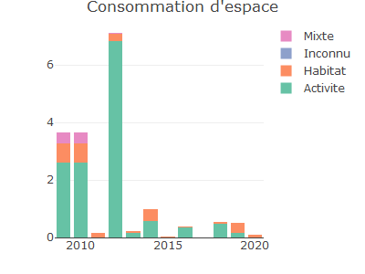
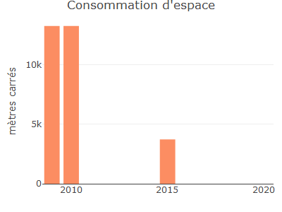

<!-- README.md is generated from README.Rmd. Please edit that file -->

> 🚧 Warning
>
> Il s’agit d’une version de développement

> 📘 Info
>
> Les wrappers d’API sont des outils qui facilitent l’utilisation des
> fonctionnalités offertes par une interface de programmation
> d’applications (API). Ils simplifient la communication entre une
> application et une API en gérant les détails techniques et en offrant
> une interface plus conviviale. Les wrappers d’API permettent aux
> développeurs de se concentrer sur la logique de leur application
> plutôt que sur les aspects techniques de l’intégration avec l’API. Ils
> accélèrent le développement et améliorent la productivité en réduisant
> la quantité de code nécessaire.

Grâce à `{r.apifoncier}` vous pouvez accéder aux données disponibles par
l’[API données foncières du
cerema](https://apidf-preprod.cerema.fr/swagger/).

# Installation

Vous pouvez installer r.apifoncier depuis [GitHub](https://github.com/)
avec le code suivant :

``` r
# install.packages("devtools")
devtools::install_github("rcadot/r.apifoncier")
```

# Indicateurs de consommation d’espace (accès libre)

Les données sont disponibles à deux échelles : communes et départements.

En indiquant le code INSEE d’une commune au format `numeric` ou
`character`, on obtient un dataframe des consommations.

``` r
library(r.apifoncier)

ind_conso_espace_communes(59001)
#>    annee idcom  idcomtxt naf_arti conso_act conso_hab conso_mix conso_inc
#> 1   2009 59001 Abancourt    13286         0     13286         0         0
#> 2   2010 59001 Abancourt    13287         0     13287         0         0
#> 3   2011 59001 Abancourt        0         0         0         0         0
#> 4   2012 59001 Abancourt        0         0         0         0         0
#> 5   2013 59001 Abancourt        0         0         0         0         0
#> 6   2014 59001 Abancourt        0         0         0         0         0
#> 7   2015 59001 Abancourt     3733         0      3733         0         0
#> 8   2016 59001 Abancourt        0         0         0         0         0
#> 9   2017 59001 Abancourt        0         0         0         0         0
#> 10  2018 59001 Abancourt        0         0         0         0         0
#> 11  2019 59001 Abancourt        0         0         0         0         0
#> 12  2020 59001 Abancourt        0         0         0         0         0
```

La fonction `g_ind_conso_espace_communes()` permet de générer un
graphique `{plotly}` de la consommation sur la commune de son choix.

``` r
ind_conso_espace_communes_g(59350)
```



Par défaut, les consommations sont affichées en hectares, mais on peut
les indiquer en m² en choisissant `hectare=FALSE`.

``` r
ind_conso_espace_communes_g(
  code_insee = 59001,
  hectare = FALSE,
  affichage = 'total',
  legende = FALSE
)
```



# Indicateurs de prix (accès libre)

Les indicateurs de prix sont disponibles annuellement et de manière
triennale à plusieurs échelles :

- Régions ;
- Départements ;
- Aires d’attractivités des villes ;
- EPCI ;
- Communes.

``` r
ind_dv3f_com_annuel('59350') %>% 
  dplyr::select(1:10) # Le résultat contient 617 colonnes
#>    annee codgeo libgeo nbtrans_cod1 valeurfonc_sum_cod1 nbtrans_cod2
#> 1   2010  59350  Lille         5120           837659942           57
#> 2   2011  59350  Lille         4474           882766180           52
#> 3   2012  59350  Lille         4200           813426374           78
#> 4   2013  59350  Lille         3971           781613569           45
#> 5   2014  59350  Lille         3931           804964493           40
#> 6   2015  59350  Lille         4472           913893573           36
#> 7   2016  59350  Lille         4708          1016164793           43
#> 8   2017  59350  Lille         5387          1315158597           49
#> 9   2018  59350  Lille         5587          1533348525           50
#> 10  2019  59350  Lille         5914          1316236006           45
#> 11  2020  59350  Lille         5115          1338281971           52
#> 12  2021  59350  Lille         5638          1368565071           74
#> 13  2022  59350  Lille         5188          1793537471           44
#>    valeurfonc_sum_cod2 nbtrans_cod11 valeurfonc_sum_cod11 nbtrans_cod111
#> 1             11280409          1018            191957219           1009
#> 2             12029527          1007            193464212           1001
#> 3             10470981           898            185220834            888
#> 4              9220512           900            176372788            891
#> 5              9204725           809            158841064            800
#> 6              5374163           950            190094699            939
#> 7             18337891          1074            218153085           1058
#> 8             21091314          1066            218596803           1045
#> 9              8863366           999            209565961            986
#> 10            21399434          1129            260309641           1125
#> 11            22967299          1068            266500635           1057
#> 12            18772045          1102            286547302           1092
#> 13            19906913          1030            281169115           1020
```
