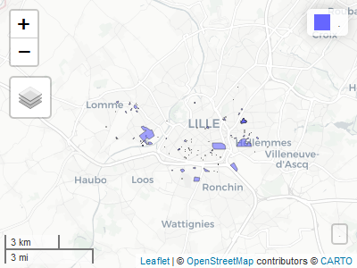

<!-- README.md is generated from README.Rmd. Please edit that file -->

> 🚧 Warning
>
> Il s’agit d’une version de développement

> 📘 Info
>
> Les wrappers d’API sont des outils qui facilitent l’utilisation des
> fonctionnalités offertes par une interface de programmation
> d’applications (API). Ils simplifient la communication entre une
> application et une API en gérant les détails techniques et en offrant
> une interface plus conviviale. Les wrappers d’API permettent aux
> développeurs de se concentrer sur la logique de leur application
> plutôt que sur les aspects techniques de l’intégration avec l’API. Ils
> accélèrent le développement et améliorent la productivité en réduisant
> la quantité de code nécessaire.

Grâce à `{r.apifoncier}` vous pouvez accéder aux données disponibles par
l’[API données foncières du
cerema](https://apidf-preprod.cerema.fr/swagger/).

# Installation

Vous pouvez installer r.apifoncier depuis [GitHub](https://github.com/)
avec le code suivant :

``` r
# install.packages("devtools")
devtools::install_github("rcadot/r.apifoncier")
```

# Consommations d’espace

## À la commune

### Indicateur de consommations d’espace communes

En indiquant le code INSEE d’une commune au format `numeric` ou
`character`, on obtient un dataframe des consommations.

``` r
library(r.apifoncier)
ind_conso_espace_communes(59001)
#>    annee idcom  idcomtxt naf_arti conso_act conso_hab conso_mix conso_inc
#> 1   2009 59001 Abancourt    13286         0     13286         0         0
#> 2   2010 59001 Abancourt    13287         0     13287         0         0
#> 3   2011 59001 Abancourt        0         0         0         0         0
#> 4   2012 59001 Abancourt        0         0         0         0         0
#> 5   2013 59001 Abancourt        0         0         0         0         0
#> 6   2014 59001 Abancourt        0         0         0         0         0
#> 7   2015 59001 Abancourt     3733         0      3733         0         0
#> 8   2016 59001 Abancourt        0         0         0         0         0
#> 9   2017 59001 Abancourt        0         0         0         0         0
#> 10  2018 59001 Abancourt        0         0         0         0         0
#> 11  2019 59001 Abancourt        0         0         0         0         0
#> 12  2020 59001 Abancourt        0         0         0         0         0
```

### Graphique associé à la consommation d’espace d’une commune

La fonction `g_ind_conso_espace_communes()` permet de générer un
graphique `{plotly}` de la consommation sur la commune de son choix.

``` r
ind_conso_espace_communes_g(59350)
```


Par défaut, les consommations sont affichées en hectares, mais on peut
les indiquer en m² en choisissant `hectare=FALSE`.

``` r
ind_conso_espace_communes_g(59001,hectare = FALSE,affichage = 'total',legende = FALSE)
#> Warning in RColorBrewer::brewer.pal(N, "Set2"): minimal value for n is 3, returning requested palette with 3 different levels

#> Warning in RColorBrewer::brewer.pal(N, "Set2"): minimal value for n is 3, returning requested palette with 3 different levels
```


## Au département

On retrouve les mêmes fonctionnalités à l’échelle départementale.

``` r
ind_conso_espace_dep(59)
#>    annee iddep naf_arti conso_act conso_hab conso_mix conso_inc
#> 1   2009    59  7160318   2411926   4331601    161717    255074
#> 2   2010    59  7160627   2412051   4331880    161779    254917
#> 3   2011    59  7148756   2659007   4138877    131963    218909
#> 4   2012    59  5405315   2015161   2961481    105407    323266
#> 5   2013    59  5996455   2109677   3600919    153014    132845
#> 6   2014    59  4999980   1601109   3162301    125174    111396
#> 7   2015    59  3252097    973713   2063197    103209    111978
#> 8   2016    59  4061015   1556719   2254362     38928    211006
#> 9   2017    59  3342142   1094209   2074584     79102     94247
#> 10  2018    59  3696251   1349675   2123473     68086    155017
#> 11  2019    59  3586737   1249801   2194795     30123    112018
#> 12  2020    59  3183794    937015   2088970     58280     99529
```

``` r
ind_conso_espace_dep_g(59)
```


